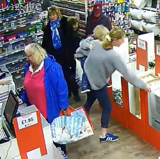

# video-tutorial

## Objectives

* To measure whether and to what extent each shopper is intereseted in each product in offline stores.
  - For example, Grace spent 40 seconds in front of a metal basket, picked it up and put it down twice; ultimately, we may infer that she is interested in the product to the extent of 80 out of 100.  
    

## Object Detection and Tracking

* PyImageSearch. (2018). [OpenCV People Counter](https://pyimagesearch.com/2018/08/13/opencv-people-counter/)
* 봉식이누나. (2020). [OpenCV를 사용하여 YOLO Object detection](https://bong-sik.tistory.com/16)
* Yukai Yang. (2020). [FastMOT](https://github.com/GeekAlexis/FastMOT)
* jinmc. (2021). [Multi Object Tracking과 활용](https://walkaroundthedevelop.tistory.com/74)
* 김민솔. (2022). [라이브 트래킹: 사람을 자동으로 따라간다고~?](https://devocean.sk.com/blog/techBoardDetail.do?ID=164297)

## YOLO v5

* Ultralytics. [Official Documents](https://github.com/ultralytics/yolov5)
